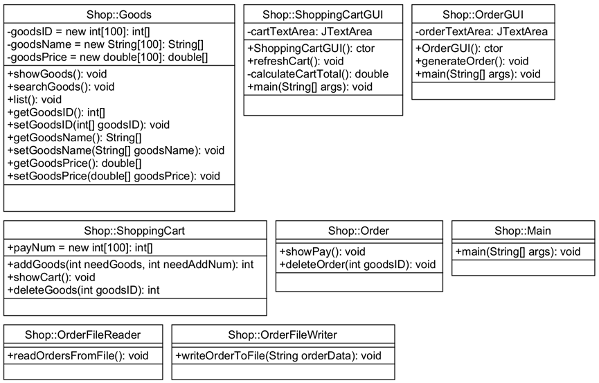

</head>
<body><h1 id='电子商务购物设计及实现'>电子商务购物设计及实现</h1>
<h2 id='一项目功能'>一、项目功能</h2>
<ol>
<li>对浏览购物车、将商品加入、移除购物车中的至少一个功能，采用图形用户界面实现。</li>

</ol>
<ol start='2' >
<li>对生成订单、浏览订单、删除订单中的至少一个功能，采用图形用户界面实现。</li>

</ol>
<ol start='3' >
<li>上述要求所实现的功能中，至少有一个功能的数据存放在文件中，通过访问文件的方式实现数据存取。</li>

</ol>
<h2 id='二类的设计'>二、类的设计</h2>

<strong>文件结构</strong>：

<h2 id='三各文件的主要功能及作用'>三、各文件的主要功能及作用</h2>
<ol>
<li><strong>主函数</strong>为：Main.java</li>

</ol>

			功能作用：主要进行功能的选择：搜索商品/商品购物/查看购物车/订单结算

<ol start='2' >
<li><strong>商品</strong>实体类和方法：Goods.java</li>

</ol>

    		功能作用：展现商品列表showGoods()/搜索商品searchGoods()

<ol start='3' >
<li><strong>订单</strong>实体类和方法：Order.java</li>

</ol>

			功能作用：显示购物车中的商品showPay()/删除订单中指定商品deleteOrder(int goodsID)

<ol start='4' >
<li><strong>购物车</strong>实体类和方法ShoppingCart.java</li>

</ol>

			功能作用：添加商品addGoods(int needGoods,int needAddNum)/显示购物车showCart()/删除商品deleteGoods(int goodsID)

<ol start='5' >
<li><strong>订单文件写</strong>操作：OrderFileWriter.java</li>

</ol>

			功能作用：创建并写入文件OrderFileWriter.writeOrderToFile(orderData)

<ol start='6' >
<li><strong>订单文件读</strong>操作：OrderFileReader.java</li>

</ol>

			功能作用：展示文件中的订单内容OrderFileReader.readOrdersFromFile()

7.<strong>浏览购物车图形用户界面</strong>实现：ShoppingCartGUI.java

			功能作用：定义ShoppingCartGUI()/获取购物车数据并显示在文本区域中refreshCart()/计算calculateCartTotal()

<ol start='8' >
<li><strong>浏览订单图形用户界面</strong>实现OrderGUI.java</li>

</ol>

			功能作用：定义OrderGUI()/生成订单generateOrder()

<ol start='9' >
<li><strong>类图</strong>：new_diagram.uxf</li>

</ol>

    		功能作用：展现各函数的定义和各函数间的关系。

<h2 id='四关键问题的解决'>四、关键问题的解决</h2>

<strong>通过使用eclipse里的Swing库建立了GUI实现了图形用户界面的展现</strong>

具体采用了以下几种方法和组件：

<ol>
<li>JFrame：创建顶级窗口，用于容纳整个应用程序的GUI。</li>

</ol>
<ol start='2' >
<li>JPanel：用于容纳其他GUI组件，并设置了垂直方向的BoxLayout布局管理器。</li>

</ol>
<ol start='3' >
<li>JTextArea: 使用了JTextArea来显示订单信息。JTextArea是一个多行文本框，适合显示大段文本或数据。它允许用户通过设置文本和滚动条来浏览和编辑信息。</li>

</ol>
<ol start='4' >
<li>JScrollPane: 为了支持大段文本的显示，你将JTextArea放置在JScrollPane中。JScrollPane提供了滚动条，允许用户在JTextArea中浏览超出可见区域的文本内容。这样，即使文本超出了JTextArea的可视范围，用户仍然可以通过滚动条进行查看。</li>

</ol>
<ol start='5' >
<li>JButton: 你的设计中包含了一个“生成订单”按钮。JButton是Swing库中的标准按钮组件，用户可以点击它执行特定的操作。</li>

</ol>
<ol start='6' >
<li>ActionListener: 生成订单按钮添加了一个ActionListener。ActionListener是一个接口，用于监听用户的动作事件，例如按钮的点击。通过实现ActionListener接口并注册到按钮上，可以在用户点击按钮时执行特定的操作或逻辑。</li>

</ol>
<ol start='7' >
<li>ActionListener 处理逻辑</li>

</ol>
<ol start='8' >
<li>处理按钮点击事件: 在ActionListener中，你调用了 generateOrder() 方法来生成订单信息。这个方法可能包含了生成订单所需的逻辑，例如处理输入数据、计算价格、保存订单等步骤。</li>

</ol>
<ol start='9' >
<li>SwingUtilities.invokeLater(): 这是一个重要的线程安全性工具。Swing是单线程的，所有的GUI操作都应该在事件调度线程（Event Dispatch Thread，EDT）中进行。SwingUtilities.invokeLater()方法用于将任务放入EDT的队列中执行，以确保所有的GUI更新和事件处理都在同一个线程中进行，避免多线程引起的并发问题。</li>

</ol>

通过结合使用JTextArea、JScrollPane、JButton和ActionListener等，实现了一个基本的图形用户界面（GUI）应用程序，用户可以通过点击按钮来生成订单，并在文本区域中显示订单信息。同时，使用SwingUtilities.invokeLater()确保了的GUI操作是线程安全的，这在Swing应用程序中至关重要。

<strong>综上所述</strong>，设计利用了Swing库中的各种组件和事件处理机制，通过这些组件和技术实现了一个简单但功能完整的GUI应用程序。

<h2 id='五存在的问题及思考'>五、存在的问题及思考</h2>

		<strong>问题：</strong>弹出窗口位置不佳:图形用户界面弹出位置不合适，可能会导致覆盖其他重要的内容或者不符合用户预期。

完成功能后无法立即关闭: 在程序完成任务后，如果立即关闭窗口会导致程序终止，而不是等待用户操作。

		<strong>遇到的困难：</strong>确定窗口大小和位置: 在GUI设计中，确定窗口的大小和位置可能是一项挑战。特别是当内容长度不确定或需要自适应时，确定正确的X和Y坐标是很重要的。

文件读取和写入操作: 在处理文件时，可能需要学习如何有效地进行读取和写入操作，以确保数据安全和程序稳定性。

		<strong>解决思路：</strong>测试和调整: 通过多次运行程序，尝试不同的窗口位置和大小，以找到最佳的显示位置。可以通过调整窗口的默认位置或者响应事件后的位置更新来改善用户体验。

学习和实践文件操作: 通过查阅文档和参考网络资源，学习如何使用Java提供的文件读取和写入API。可以编写代码来处理文件的读取和写入，确保程序可以安全地管理数据。

		<strong>收获：</strong>在这个过程中学到了很多关于使用Java Swing库构建图形用户界面的知识。通过实践，不仅解决了窗口位置和关闭时的问题，还掌握了文件操作的基本技能。这些经验不仅有助于改进当前的应用程序，还为将来的项目提供了宝贵的经验和技能基础。

<h2 id='六项目运行使用说明书'>六、项目运行使用说明书</h2>

<strong>(1)在购物过程中的注意事项</strong>

<ol>
<li>在选择了商品购物选项后，如果是失误进入可通过输入#来退出商品购买过程。</li>

</ol>

<ol start='2' >
<li>如果决定要购物则再次输入2来进行确定。</li>

</ol>
<ol start='3' >
<li>接着输入的是购物的编号和对应的购物数量，输入完成后，如要退出添加商品阶段则输入-1空格-1来退出商品添加阶段，进入删除商品阶段。</li>

</ol>

<ol start='4' >
<li>删除商品阶段首先进行的是判断是否要删除商品，如果选择删除商品则输入商品编号即可删除该商品，如果没有想删除的商品则输入-1，跳过删除商品阶段。</li>

</ol>

<strong>(2)查看购物车的注意事项</strong>

		当选择查看购物车时，会自动弹出一个窗口，当用户点击刷新购物车后就会显示当前购物车中的内容，但注意浏览完成之后不能立即点击×号关闭该窗口，否则程序会提前结束进程，导致无法进行下面的操作（需要重新开始运行程序）

<strong>注意：</strong>

		<strong>商品购买·包含两个阶段：添加商品阶段+删除商品阶段</strong>

		<strong>所以是输入#退出的是商品购买。（程序中的&amp;是指和的意思）</strong>

<strong>(3)订单结算的注意事项</strong>

		当选择订单结算时，会自动弹出一个窗口，当用户点击生成订单后就会自动生成订单内容并将订单内容写入自动创建的的文件order.txt（在本文档内自动创建），但注意生成订单窗口完成之后不能立即点击×号关闭该窗口，否则程序会提前结束进程，导致无法进行下面的操作（需要重新开始运行程序）

</body>
</html>
